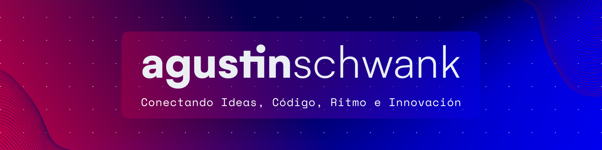

<!-- Banner -->

<!-- end Banner -->

<!-- About Me -->
<h1 align="left">🚀 Explorador Creativo en el Código y el Arte</h1>
<pre>
🌐 Mi sitio web personal: <a href="https://agustinschwank.com.ar" target="_blank" alt="sitio web oficial">www.agustinschwank.com.ar</a>
📝 Regularmente escribo articulos sobre musica, informatica, tutoriales, entre otros.
😃 Te gusta la musica?, entonces escucha mi radio en: <a href="https://vivramos.com" target="_blank" alt="sitio web de vivramos">www.vivramos.com</a>
🎨 Fusiono código, arte y música para crear experiencias únicas.
🔍 Siempre buscando conexiones únicas a través de la programación y el diseño.
📫 Contacto: <a href="mailto:hola@agustinschwank.com.ar" alt="enviar correo electronico">hola@agustinschwank.com.ar</a>
</pre>
<!-- End About Me -->
<!-- Social Media -->
<h1 align="left">🚀 Social Media</h1>

 
[-%23000000?style=for-the-badge&logo=x&logoColor=white)](https://twitter.com/agustinschwank) 
 
 
<!-- End Socials Media -->

<!-- Languages and Tools Section -->
<h1 align="left">🛠️ Lᴀɴɢᴜᴀɢᴇs ᴀɴᴅ Tᴏᴏʟs</h1> 
<!-- Section -->

  <kbd>
     
    

      <kbd>LANGUAGES</kbd>
    

      
    
&emsp;
      &nbsp;
      &ensp;
      &ensp;
      &ensp;
      &emsp;
    

     
  </kbd>
   &emsp;
  <kbd>
     
    

      <kbd>DATABASES</kbd>
    

      
    
&emsp;
      &ensp;
      &ensp;
      &emsp;
    

     
  </kbd>
  &emsp;
  <kbd>
     
    

      <kbd>HOSTING/SAAS</kbd>
    

      
    
&emsp;
      &nbsp;
      &emsp;
    

     
  </kbd>
    
  <kbd>
     
    

      <kbd>FRAMEWORKS/PLATFORMS/LIBRARIES</kbd>
    

      
    
&emsp;
      &nbsp;
      &ensp;
      &ensp;
      &ensp;
      &ensp;
      &ensp;
      &ensp;
      &ensp;
      &ensp;
      &ensp;
      &ensp;
      &emsp;
    

     
  </kbd>
     
  <kbd>
     
    

      <kbd>SERVERS</kbd>
    

      
    
&emsp;
      &nbsp;
      &emsp;
    

     
  </kbd>
   &emsp;
  <kbd>
     
    

      <kbd>DEVOPS/OTHER</kbd>
    

      
    
&emsp;
      &nbsp;
      &emsp;
    

     
  </kbd>
  &emsp;
  <kbd>
     
    

      <kbd>DESIGN</kbd>
    

      
    
&emsp;
      &nbsp;
      &ensp;
      &ensp;
      &ensp;
      &ensp;
      &ensp;
      &emsp;
    

     
  </kbd>

